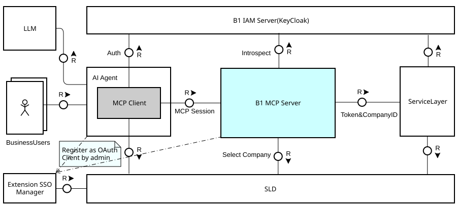

# SAP Business One MCP Server Sample

- [SAP Business One MCP Server Sample](#sap-business-one-mcp-server-sample)
  - [Introduction](#introduction)
  - [Architecture Overview](#architecture-overview)
  - [Available MCP Tools](#available-mcp-tools)
    - [Core Discovery and Execution Tools](#core-discovery-and-execution-tools)
      - [Progressive 3-Step Discovery](#progressive-3-step-discovery)
    - [Company Selection Tools](#company-selection-tools)
    - [Workflow Helper Tools](#workflow-helper-tools)
    - [MCP Resources](#mcp-resources)
  - [Prerequisites](#prerequisites)
  - [Installation](#installation)
  - [Configuration](#configuration)
    - [Direct Mode (Development Only)](#direct-mode-development-only)
    - [OAuth Mode (Production, Default mode)](#oauth-mode-production-default-mode)
    - [HTTPS / Transport](#https--transport)
  - [Running the Server](#running-the-server)
  - [Connecting an AI Client](#connecting-an-ai-client)
    - [Cline (VS Code)](#cline-vs-code)
    - [GitHub Copilot (VS Code)](#github-copilot-vs-code)
    - [Goose (Desktop)](#goose-desktop)
    - [MCP Inspector (Browser)](#mcp-inspector-browser)
  - [MCP Client Integration](#mcp-client-integration)
  - [Human Confirmation (MCP Elicitation)](#human-confirmation-mcp-elicitation)
  - [Personal Data Classification](#personal-data-classification)
    - [How fields are classified](#how-fields-are-classified)
    - [Where classification appears](#where-classification-appears)
    - [Runtime protections](#runtime-protections)
    - [Redaction behavior for read results](#redaction-behavior-for-read-results)
  - [UDO/UDT/UDF Support](#udoudtudf-support)
    - [UDO Naming](#udo-naming)
    - [Discovery Delay](#discovery-delay)
  - [Multi-Tenant Support](#multi-tenant-support)
  - [Usage Examples](#usage-examples)
    - [Natural Language Queries](#natural-language-queries)
    - [Workflow Examples](#workflow-examples)
      - [Basic CRUD Workflow](#basic-crud-workflow)
      - [Order to Cash Workflow (Step-by-Step)](#order-to-cash-workflow-step-by-step)
    - [Business Intelligence Queries](#business-intelligence-queries)
    - [Data Manipulation](#data-manipulation)
  - [Testing the Server](#testing-the-server)
    - [Unit Tests](#unit-tests)
    - [Integration Tests](#integration-tests)
    - [Full Quality Check](#full-quality-check)
  - [Logging](#logging)
    - [Application Logs](#application-logs)
    - [Audit Logs](#audit-logs)
  - [Security Considerations](#security-considerations)
    - [Authentication](#authentication)
    - [Authorization](#authorization)
    - [Production Configuration](#production-configuration)
  - [Troubleshooting](#troubleshooting)
    - [Server or connection issues](#server-or-connection-issues)
    - [Authentication and company context](#authentication-and-company-context)
    - [Entity, field, or write issues](#entity-field-or-write-issues)
    - [Enable debug options](#enable-debug-options)
  - [Configuration Reference](#configuration-reference)
  - [Limitation](#limitation)

---

## Introduction

As of SAP Business One 10.0 FP2608, a sample for SAP Business One MCP Server is provided to demonstrate how SAP B1 Service Layer OData services can be exposed as dynamic tools for AI agents that support the [Model Context Protocol (MCP)](https://modelcontextprotocol.io/). 

The sample server is designed to be minimal and easy to understand, while still showcasing the core patterns and capabilities of an MCP server. Instead of registering hundreds of individual CRUD tools (one per entity × operation), the server uses a **progressive discovery architecture** that collapses hundreds of potential tools down to several intelligent, reusable tools.

This design gives AI assistants the ability to:
- **Discover** relevant B1 entities through lightweight semantic search
- **Understand** complete entity schemas including properties, types, and capabilities
- **Execute** authenticated CRUD operations with automatic OData query generation

Natural language requests such as *"Show me the top 10 customers by balance"* or *"Create a purchase order for vendor V00001"* are automatically translated into proper Service Layer API calls.

> **This project is provided as a sample for reference and learning purposes only.** It is not necessarily a production-ready product. SAP B1 partners and developers are encouraged to study the architecture, adapt the code, evaluate the built-in capabilities, and build their own MCP server implementations tailored to their specific business requirements and deployment environments.

> **Version Requirement:** This MCP server requires **SAP Business One 10.0 FP2608 or higher**. It relies on Service Layer APIs introduced in FP2608 and will not function correctly with earlier versions.

> **MCP Protocol Version:** This sample implements MCP protocol version **2025-11-25**, which is the latest version of the [Model Context Protocol specification](https://modelcontextprotocol.io/specification/2025-11-25) for SAP Business One 10.0 FP2608. MCP clients that connect to this server must also support protocol version `2025-11-25`. As the MCP protocol continue to evolve, this sample will be updated to keep pace with new specification releases.
---

## Architecture Overview

The MCP server sits between an AI agent (Cline, GitHub Copilot, Cursor, etc.) and SAP B1 Service Layer. 
The SAP Business One MCP Server implements a modern, layered architecture that transforms OData service contracts into AI-friendly MCP tools. The architecture is organized around a progressive discovery pattern that balances token efficiency with comprehensive capability exposure.



In this architecture, the MCP client in the AI agent interacts with the MCP server through a secure HTTP transport layer that implements the MCP protocol. For authentication, the MCP server uses OAuth2 with Keycloak. The MCP client or AI Agent registers as an OAuth client via Extension SSO Manager and obtains an access token through the standard OAuth2 flow. Using this token, clients can optionally fetch company list from the SLD to include the correct company context in requests. The server validates each incoming request by verifying the Bearer token against Keycloak to ensure only authenticated clients can access the MCP tools, and checking the audience claim to ensure the token is intended for this server.

---


## Available MCP Tools

> **Important:** Tools are consumed by AI models and do not constitute a stable API. Tool names, parameters, and behavior may change between versions. Do not build hard dependencies on specific tool signatures.

### Core Discovery and Execution Tools

The server uses **4 core discovery/execution tools** instead of hundreds of individual CRUD tools:

| Tool     | Description | Parameters      |
|----------|-------------|-----------------|
| `b1_find_entities` | **Step 1**: Searches SAP Business One Service Layer entities by business category and optional name filter. Returns a minimal list (entityName, categories). If no matches are found, all entities are returned. Use `b1_get_entity_schema` next to retrieve the full schema for a selected entity. Use `category='workflow'` to discover the available workflow helper tools and their descriptions. | - `category` (optional): Business area filter. Default: 'all'.<br>- `query` (optional): Search term for entity names<br>- `limit` (optional): Maximum results to return (min: 1, max: 50, default: 20) |
| `b1_get_entity_schema` | **Step 2**: Get the schema for a SAP B1 entity. Step 2.1: call with `entityName` only — returns all properties and structural (complex) types. Step 2.2 (optional): call with `entityName` + `structuralTypeName` to drill into a complex type's sub-properties. Step 2.1 must be called first for the same entity. | - `entityName` (required): B1 entity name from `b1_find_entities` results (case-sensitive, e.g. "BusinessPartners")<br>- `structuralTypeName` (optional, Step 2.2 only): Use the `complexTypeName` from a `structuralProperties` entry in the Step 2.1 result. Example: 'DocumentLine' |
| `b1_read` | **Step 3a**: Executes read operations on SAP B1 Service Layer entities. Use `b1_get_entity_schema` first to confirm field names and key properties. Supports `read` for list queries and `read-single` for a specific entity by key. | - `entityName` (required): The entity name<br>- `operation` (required): `read` or `read-single`<br>- `parameters` (optional): Key fields for `read-single` (e.g. `{ DocEntry: 1 }`); omit for list reads<br>- `filterString` (optional): OData $filter query<br>- `selectString` (optional): OData $select for specific fields<br>- `orderbyString` (optional): OData $orderby for sorting<br>- `topNumber` (optional): Number of records to return<br>- `skipNumber` (optional): Number of records to skip (pagination) |
| `b1_write` | **Step 3b**: Executes write operations on SAP B1 Service Layer entities: create, update, and delete. Requires elicitation confirmation before execution. | - `entityName` (required): The entity name<br>- `operation` (required): `create`, `update`, or `delete`<br>- `parameters` (required): Entity data as a flat object. `create`: body fields only. `update`: key fields + fields to change (handler separates them automatically). `delete`: key fields only |

#### Progressive 3-Step Discovery

The server avoids tool explosion by condensing everything into a 3-step flow:

```
Step 1: b1_find_entities        → Lightweight semantic search; returns entity names and categories
Step 2: b1_get_entity_schema    → Full schema for a selected entity (properties, types, keys)
Step 3: b1_read / b1_write      → Execute the read or write operation with schema-informed parameters
```

- **Token efficiency**: Step 1 returns ~90% less data than full schemas
- **Clear separation**: The LLM can scan and select before committing to a full schema fetch
- **Progressive detail**: Complex types can be drilled into in a Step 2.2 call without fetching everything upfront


### Company Selection Tools

In OAuth mode, select a company before calling entity tools:

| Tool     | Description | Parameters      |
|----------|-------------|-----------------|
| `b1_list_companies` | **OAuth Step 0**: Returns the list of available SAP B1 companies. Returns: CompanyID, CompanySchemaName, CompanyName, Status. Use `b1_select_company` with the `CompanySchemaName` next. | None |
| `b1_select_company` | **OAuth Step 1**: Selects the active SAP B1 company for all subsequent requests. Optionally retrieves detailed company information (version, localization, etc.). Next: use `b1_find_entities` to search available entities. | - `companySchemaName` (required): Company schema name from `b1_list_companies` (e.g. 'SBODEMOUS')<br>- `getDetails` (optional): Retrieve detailed company information. Default: false |

### Workflow Helper Tools

Two workflow helper tools simplify common B1 business workflows:

| Tool     | Description | Parameters      |
|----------|-------------|-----------------|
| `b1_copy_document` | Creates a new sales document by copying an existing source document, automatically resolving BaseType, BaseEntry, and BaseLine references. Supports standard B1 flows: Order→Delivery, Delivery→Invoice, Order→Invoice. | - `sourceEntityName` (required): Source entity (e.g., "Orders", "DeliveryNotes")<br>- `sourceDocEntry` (required): DocEntry of source document<br>- `targetEntityName` (required): Target entity to create (e.g., "DeliveryNotes", "Invoices")<br>- `lineSelections` (optional): Zero-based line indexes to copy; omit for all lines<br>- `additionalFields` (optional): Header fields to add/override |
| `b1_create_payment` | Validates and creates an incoming payment for one or more A/R invoices. Fetches open balances and allocates payment automatically (oldest-first) or manually before posting. | - `cardCode` (required): Business Partner code<br>- `invoiceDocEntries` (required): Array of invoice DocEntry values<br>- `paymentAmount` (required): Total payment amount to allocate<br>- `allocationType` (optional): `auto` or `manual` (default: `auto`)<br>- `manualAllocations` (optional): Required with `allocationType=manual`; per-invoice amount allocation<br>- `transferAccount` (optional): G/L transfer account<br>- `transferDate` (optional): Payment date (`YYYY-MM-DD`)<br>- `transferReference` (optional): Payment reference/check number<br>- `remarks` (optional): Payment notes<br>- `validateOnly` (optional): If true, validates without posting. Default: false (validate and post) |

**Discovering workflow tools at runtime:**

```
Show me what workflow tools are available in the B1 MCP server
```

The AI agent calls `b1_find_entities` with `category: 'workflow'` and receives the full descriptions of `b1_copy_document` and `b1_create_payment`.

### MCP Resources

Two resource types provide contextual knowledge without tool calls:

| Resource URI Pattern | Description |
|---------------------|-------------|
| `b1://service-layer/metadata` | Service and entity metadata for the Service Layer. |
| `b1://constants/{type}` | Reference data including objectTypes, documentFlows, fieldPatterns, statuses, paymentTypes, and all. Example: `b1://constants/objectTypes` |

**Benefits**: AI assistants can access these resources instantly without tool calls - more efficient for workflows!

---

## Prerequisites

| Requirement | Minimum version |
|---|---|
| Node.js | 22.22.3 |
| npm | 10.9.8 |
| SAP B1 Service Layer | FP2608 |
| SAP B1 Identity and Authentication Management (IAM-Keycloak) | FP2608 |
| SAP B1 System Landscape Directory (SLD) | FP2608 |

---

## Installation

1. Download this package `b1-mcp-server.zip` from the online help, unpack it and then navigate to the unpacked project folder.
2. Install dependencies and compile:

```bash
npm install
npm run build
```
---

## Configuration

All settings are controlled through a `.env` file in the project root. Copy `.env.example` as a starting point:

```bash
cp .env.example .env
```

For a complete reference of every available variable, see the [Configuration Reference](#configuration-reference) chapter.

### Direct Mode (Development Only)

Use this mode when SAP B1 Service Layer is accessible with a username and password. Suitable for quick prototyping in local development environment and testing only.

> **Note:** Despite using a username and password in the `.env` file, this is **not** HTTP Basic Authentication. The credentials are used by the MCP server to obtain a session token from SAP B1 Service Layer via its login API (`/b1s/v2/Login`), and all subsequent requests are authenticated with that session token.

```env
NODE_ENV=development
AUTHENTICATION_MODE=direct

# B1 Service Layer host (server appends /b1s/v2/ internally)
SERVICE_LAYER_ROOT_URL=https://servicelayer.b1.example.com:50000

B1_COMPANY_DB=yourCompanyDB
B1_USERNAME=yourUsernameHere
B1_PASSWORD=yourPasswordHere

# Accept self-signed certs for local development/testing only
AUTH_ALLOW_SELF_SIGNED=true
```

### OAuth Mode (Production, Default mode)

Use this default mode since the Service Layer is always fronted by Keycloak. Incoming bearer tokens are validated against the OAuth provider before any B1 request is forwarded.

```env
# Default mode, validate incoming requests via OAuth 2.0 / OIDC (requires OAUTH_BASE_URL and OAUTH_CLIENT_ID)
AUTHENTICATION_MODE=oauth

SERVICE_LAYER_ROOT_URL=https://servicelayer.b1.example.com:50000
SLD_ROOT_URL=https://sld.b1.example.com:40000

OAUTH_BASE_URL=https://keycloak.b1.example.com/auth/realms/sapb1/
OAUTH_CLIENT_ID=your-client-id
OAUTH_CLIENT_SECRET=your-client-secret

```

### HTTPS / Transport

The server uses HTTPS by default, and use a self-signed certificate for local development. You can also switch to HTTP if you prefer.

**HTTPS (default):**
```env
HTTPS_ENABLED=true
HTTPS_KEY_PATH=./certs/server.key
HTTPS_CERT_PATH=./certs/server.crt
PORT=3000

# Optional:
# HTTPS_CA_PATH=./certs/ca.crt
# HTTPS_PASSPHRASE=your-cert-passphrase
```

**HTTP:**

If you want HTTP instead of HTTPS due to local testing or avoiding browser security warning issues or other reasons (e.g. You already have a upfront HTTPS gateway or reverse proxy), set:

```env
HTTPS_ENABLED=false
PORT=3000
```

**Advertised public URL (`MCP_BASE_URL`):**

By default the server derives its advertised URL from the active listener settings. If the server is behind a reverse proxy or you need clients to use a specific base URL for OAuth metadata and MCP endpoints, set this explicitly:

```env
MCP_BASE_URL=https://mcp.example.com
```

Leave it unset for local development — the server will infer the correct URL automatically.

---

## Running the Server

Start the server:

```bash
npm start
```

Verify it is running:

```bash
curl http://localhost:3000/health
```

The server exposes three built-in REST endpoints:

| Endpoint | Description |
|---|---|
| `GET /health` | Liveness check — returns status, version, and component health |
| `GET /mcp` | Server metadata — protocol version, capabilities, active sessions |
| `GET /docs` | Brief API reference — endpoints, MCP capabilities, usage hints |

> **OAuth note:** In OAuth mode, `GET /mcp` requires a valid bearer token in the `Authorization` header.

**`GET /health` — example response:**

```json
{
  "status": "healthy",
  "timestamp": "2026-06-17T03:50:58.338Z",
  "version": "1.0.0",
  "checks": {
    "auditLogger": { "healthy": true },
    "personalFieldCache": { "healthy": true }
  }
}
```

**`GET /mcp` — example response:**

```json
{
  "name": "b1-mcp-server",
  "version": "1.0.0",
  "protocol": { "version": "2025-11-25", "transport": "streamable-http" },
  "capabilities": { "tools": {}, "resources": {}, "logging": {} },
  "features": [
    "Dynamic SAP Business One Service Layer OData service discovery",
    "CRUD operations for all discovered entities",
    "Natural language query support",
    "Session-based HTTP transport",
    "Real-time service metadata"
  ],
  "endpoints": { "health": "/health", "mcp": "/mcp", "docs": "/docs" },
  "activeSessions": 1
}
```

---

## Connecting an AI Client

The server exposes a **Streamable HTTP** MCP endpoint at:

```
http(s)://<host>:<port>/mcp
```

Any MCP-compatible AI client can connect to this endpoint. The table below summarizes key capabilities across the supported clients:

| Client | Transport type | MCP Elicitation | OAuth / PKCE |
|---|---|---|---|
| Cline (VS Code) | `streamableHttp` | Not supported (v4.0.8) | Built-in PKCE flow |
| GitHub Copilot (VS Code) | `http` | Supported | Built-in PKCE flow |
| Goose (Desktop) | `streamable_http` | Supported | Built-in PKCE flow |

> MCP Elicitation is used for human confirmation of write operations and sensitive reads. If your client does not support it, set `MCP_HUMAN_CONFIRMATION_ENABLED=false` in `.env` or those operations will be rejected. See [Human Confirmation (MCP Elicitation)](#human-confirmation-mcp-elicitation) for details.

---

### Cline (VS Code)

For setup instructions, LLM provider configuration, OAuth / Keycloak setup, and test examples covering all CRUD operations and workflow tools, see [docs/B1_CLINE_INTEGRATION_GUIDE.md](docs/B1_CLINE_INTEGRATION_GUIDE.md).

---

### GitHub Copilot (VS Code)

For setup instructions, OAuth / Keycloak setup, static client ID configuration, OAuth company selection flow, and elicitation test examples, see [docs/B1_GITHUB_COPILOT_INTEGRATION_GUIDE.md](docs/B1_GITHUB_COPILOT_INTEGRATION_GUIDE.md).

---

### Goose (Desktop)

For setup instructions, configuration options, OAuth / Keycloak setup, and usage examples, see [docs/B1_GOOSE_INTEGRATION_GUIDE.md](docs/B1_GOOSE_INTEGRATION_GUIDE.md).

---

### MCP Inspector (Browser)

Use the [MCP Inspector](https://github.com/modelcontextprotocol/inspector) to interactively browse tools and inspect raw MCP messages. For full usage instructions — including how to obtain a bearer token and set required headers in OAuth mode — see [docs/MCP_INSPECTOR.md](docs/MCP_INSPECTOR.md).

---

## MCP Client Integration

If you are building a custom MCP client application that connects to the server in OAuth mode, the integration follows a standard PKCE OAuth 2.0 flow:

1. Discover OAuth metadata from `GET /mcp` (the server advertises its authorization and token endpoints).
2. Initiate a PKCE authorization request and redirect the user to Keycloak.
3. Exchange the authorization code for tokens (access token + refresh token).
4. Fetch available companies using `b1_list_companies`.
5. Let the user select a company and call `b1_select_company`.
6. Include the access token and company ID in every MCP request:
   - `Authorization: Bearer <access_token>`
   - `x-b1-companyID: <companySchemaName>`
7. Refresh the token before expiry; re-initiate the PKCE flow on refresh failure.

For a complete working example with annotated code — including client registration, OAuth flow, company selection, and expected output — see [docs/SIMPLE_MCP_CLIENT.md](docs/SIMPLE_MCP_CLIENT.md).

---

## Human Confirmation (MCP Elicitation)

[MCP Elicitation](https://modelcontextprotocol.io/docs/concepts/elicitation) is a protocol-level mechanism that allows an MCP server to pause a tool call mid-execution and ask the connected client for additional input or confirmation before proceeding. Unlike a simple prompt, elicitation is built into the MCP protocol: the server sends a structured request to the client, the client presents it to the user (typically as an inline dialog or form), and the server waits for the response before deciding whether to continue or abort. This keeps the human in the loop for sensitive operations without requiring the AI agent to improvise its own confirmation flow.

When `MCP_HUMAN_CONFIRMATION_ENABLED=true` (the default), the server pauses before:
- **Write operations** (`create`, `update`, `delete`) — prompts for explicit user approval
- **Sensitive reads** — prompts when the query selects fields classified as personal data (email, phone, identity numbers)

Clients that support elicitation (such as GitHub Copilot) display an inline confirmation dialog. The user must approve before the server proceeds; declining cancels the operation without modifying any data.

**Example write confirmation prompt:**
```
CONFIRM WRITE OPERATION | OPERATION: update | ENTITY: BusinessPartners |
TARGET: C00001 | FIELDS: Phone1=+1 555-1234 |
RISK: This action will modify SAP Business One data. |
ACTION: Set confirmed=true only if you intend to continue.
```

**Clients without elicitation support (e.g. Cline v4.0.8):**

The server will reject sensitive reads and write operations rather than proceeding without confirmation. To bypass this in automated or development pipelines, set:

```env
MCP_HUMAN_CONFIRMATION_ENABLED=false
```
---

## Personal Data Classification

The server uses SAP Business One PersonalFieldsSetups metadata (resolved per table via `PersonalFieldsSetupsService_GetPersonalFieldsByTable`) to classify sensitive fields and apply safeguards during reads and writes.

### How fields are classified

- Classification source: Service Layer table-scoped personal-field entries returned by `PersonalFieldsSetupsService_GetPersonalFieldsByTable`.
- Matching rule: A property is marked personal when table name + field name matches a PersonalFieldsSetups row.
- Scope: Classification is applied to both top-level entity properties and nested complex-type properties.
- Nested resolution: For complex properties, table context switches using child table mapping and continues recursively for deeper nesting.

### Where classification appears

- In Step 2 schema output via `b1_get_entity_schema`, personal properties are flagged with isPersonalField.
- This includes scalar fields and nested structural type properties when the table mapping marks them as personal.

### Runtime protections

When MCP_HUMAN_CONFIRMATION_ENABLED=true:

- Write operations (create, update, delete) require explicit MCP elicitation confirmation.
- Sensitive reads require confirmation when selectString explicitly includes personal top-level fields.

If the client does not support MCP elicitation, these protected operations are blocked.

### Redaction behavior for read results

Read redaction depends on whether selectString is meaningful:

- No selectString (or blank/whitespace): full-response redaction is applied recursively to personal fields in both top-level and nested complex data.
- Meaningful selectString with only scalar selections: selected scalar fields are returned as requested.
- Meaningful selectString including complex properties: selected scalar fields remain visible, and personal fields inside selected complex properties are redacted recursively.

This means a selected top-level scalar personal field can be visible after user confirmation, while nested personal fields inside selected complex properties are still redacted.

For more details about personal data configuration, see this link: [SAP Business One Help Portal - Protecting Personal Data](https://help.sap.com/docs/SAP_BUSINESS_ONE/68a2e87fb29941b5bf959a184d9c6727/ca81efc2aaad404eb852a946d0daba48.html?state=DRAFT&locale=en-US&version=10.0&q=data+privacy).

---

## UDO/UDT/UDF Support

The server automatically discovers and exposes **User-Defined Objects (UDO)**, **User-Defined Tables (UDT)**, and **User-Defined Fields (UDF)** alongside standard SAP B1 entities — no additional configuration required.

- **UDOs** registered in SAP B1 appear as queryable and writable entities in `b1_find_entities`, discoverable under their assigned business category.
- **UDTs** (custom tables prefixed with `@`) are surfaced as first-class entities and support the same CRUD operations as standard entities.
- **UDFs** added to standard or custom tables are included automatically in the schema returned by `b1_get_entity_schema`, with correct types and metadata.

This means any customization made in SAP B1 — partner extensions, localization add-ons, or customer-specific fields — is immediately available to AI agents through the same 3-step discovery flow, without any server-side changes.

### UDO Naming 

UDO codes must comply with OData identifier rules to be recognized by Service Layer. Use only letters, digits, and underscores — no spaces or other special characters (e.g. use `MY_CUSTOM_OBJECT`, not `My Custom Object`). UDOs with non-compliant codes will not be discoverable.

### Discovery Delay

UDOs and UDTs added or modified through the SAP B1 client, Web Client, or add-ons are not reflected in the MCP server immediately. The server caches OData metadata fetched from Service Layer for a configurable period (default: 30 minutes, controlled by `METADATA_CACHE_TTL_MINUTES`). New or changed UDOs/UDTs will only become discoverable after the cache expires naturally, or when the MCP server is restarted. During active development of custom objects, lower `METADATA_CACHE_TTL_MINUTES` to a smaller value (e.g. `5`) to pick up changes faster.

---

## Multi-Tenant Support

A single MCP server instance can serve multiple SAP Business One companies without any configuration changes. In OAuth mode, the active tenant or company is selected dynamically at runtime using the System Landscape Directory (SLD).

**How it works:**

1. The MCP client calls `b1_list_companies` to retrieve all available companies registered in the SLD, along with their status.
2. The user (or AI agent, guided by the user) selects the target company by calling `b1_select_company` with the chosen `CompanySchemaName`.
3. All subsequent tool calls (`b1_find_entities`, `b1_read`, `b1_write`, etc.) are routed to the selected company's Service Layer database for the duration of the session.
4. To switch companies, call `b1_select_company` again with a different schema name — no server restart required.

**Key characteristics:**

- **Session-scoped:** Company selection is bound to the MCP session. Different AI client sessions can operate against different companies simultaneously on the same server instance.
- **SLD-driven:** The company list is sourced directly from the SLD and reflects the live state of registered companies. No static company list needs to be maintained in configuration.
- **OAuth-only:** Multi-tenant company switching requires OAuth mode. Direct mode is single-company only (`B1_COMPANY_DB` is fixed in `.env`).

> **Note:** If a valid `x-b1-companyID` header is already present in the request, the MCP server uses it directly — calling `b1_list_companies` and `b1_select_company` is not required. The purpose of those tools is simply to help the AI agent or user determine the correct company schema name and establish the company context when it is not already known. Once the desired company is known, its company ID (resolved from the `CompanySchemaName`) can be passed directly in the `x-b1-companyID` header of every subsequent MCP request.

---

## Usage Examples

### Natural Language Queries

| Natural Language | Tool Called | Generated Parameters |
|---|---|---|
| "Show me 10 sales orders" | `b1_read` | `{ entityName: "Orders", operation: "read", topNumber: 10 }` |
| "Get sales order DocEntry 12345" | `b1_read` | `{ entityName: "Orders", operation: "read-single", parameters: { DocEntry: 12345 } }` |
| "Find sales orders over $1000" | `b1_read` | `{ entityName: "Orders", operation: "read", filterString: "DocTotal gt 1000" }` |
| "Create a purchase order for vendor V00001" | `b1_write` | `{ entityName: "PurchaseOrders", operation: "create", parameters: { CardCode: "V00001" } }` |
| "Update business partner C00001 phone number" | `b1_write` | `{ entityName: "BusinessPartners", operation: "update", parameters: { CardCode: "C00001", Phone1: "123-456-7890" } }` |

---

### Workflow Examples

> To implement additional business workflows or add new MCP tools, see [docs/DEVELOPER_GUIDE.md](docs/DEVELOPER_GUIDE.md).

#### Basic CRUD Workflow
```
1. b1_find_entities → "BusinessPartners"
  ↓ Returns: List of matching entities

2. b1_get_entity_schema → "BusinessPartners"
  ↓ Returns: scalar properties plus structuralProperties[]

3. b1_get_entity_schema → "BusinessPartners", structuralPropertyName="ContactEmployees"
  ↓ Returns: sub-properties for that structural property when needed

4. b1_read or b1_write → execute the selected operation
   ✓ Executes operation with proper parameters
```

#### Order to Cash Workflow (Step-by-Step)
```
1. b1_write → Create Sales Order
   ↓ Returns: DocEntry 123

2. b1_copy_document → Order → Delivery
   ↓ Returns: DocEntry 456 (automatic BaseType handling)

3. b1_copy_document → Delivery → Invoice
   ↓ Returns: DocEntry 789 (automatic BaseType handling)

4. b1_create_payment → Create Payment
   ✓ Validates and creates payment (automatic balance checking)
```

### Business Intelligence Queries
```
User: "Show me top 10 customers by balance"
→ Tool: b1_read
→ Parameters:
  {
    "entityName": "BusinessPartners",
    "operation": "read",
    "filterString": "CardType eq 'cCustomer'",
    "orderbyString": "CurrentAccountBalance desc",
    "topNumber": 10
  }
```

```
User: "How many open sales orders are there?"
→ Tool: b1_read
→ Parameters:
  {
    "entityName": "Orders",
    "operation": "read",
    "filterString": "DocumentStatus eq 'bost_Open'",
    "selectString": "DocEntry"
  }
```

### Data Manipulation
```
User: "Update supplier V10000 to have phone number 123-456-7890"
→ Tool: b1_write
→ Parameters:
  {
    "entityName": "BusinessPartners",
    "operation": "update",
    "parameters": {
      "CardCode": "V10000",
      "Phone1": "123-456-7890"
    }
  }
```

---

## Testing the Server

### Unit Tests

```bash
npm test
```

This is an alias for `npm run test:unit`. Unit tests live under `src/tests/unit/`.

### Integration Tests

Integration tests require a running MCP server with a reachable Service Layer and OAuth provider. They also require the `b1_mcp:access` scope to be configured in Keycloak — see [KEYCLOAK_SETUP.md](./docs/KEYCLOAK_SETUP.md) for setup instructions. Configure the test client credentials in your `.env`, then run:

```bash
npm run test:integration
```

Key variables for integration tests:

| Variable | Description |
|---|---|
| `TEST_MCP_CLIENT_ID` | OAuth client ID used by the test runner |
| `TEST_OAUTH_SCOPES` | Scopes to request (e.g. `email b1_mcp:access profile`) |
| `TEST_OAUTH_INTERACTIVE` | Set to `true` to trigger a browser-based login during tests |

Integration tests live under `src/tests/integration/`.

> **Note:** If a test fails after updating dependencies, run `npm run build` first — compile-time errors often surface there before the test runner does.

### Full Quality Check

Run lint, build, and unit tests in sequence:

```bash
npm run lint
npm run build
npm test
npm run test:integration
```
---


## Logging

The server produces two separate log streams, each independently configurable.

### Application Logs

Application logs cover request handling, tool dispatch, session lifecycle, and Service Layer calls. The default level is `info`. Enable verbose logging during development to trace what the server is doing:

```env
APP_LOG_LEVEL=debug
APP_LOG_CONSOLE_ENABLED=true
```

Logs are written to a rotating file by default (`APP_LOG_FILE_ENABLED=true`). File size and retention are controlled by `APP_LOG_MAX_SIZE_BYTES` (default 10 MB) and `APP_LOG_RETENTION_DAYS` (default 90 days).

### Audit Logs

Audit logs record security-relevant events: write confirmations, session starts and expiry, and authentication failures. They are written to a rotating file by default and should remain enabled in production.

To also stream audit events to the console during development:

```env
AUDIT_LOG_CONSOLE_ENABLED=true
```

File size and retention are controlled by `AUDIT_LOG_MAX_SIZE_BYTES` (default 10 MB) and `AUDIT_LOG_RETENTION_DAYS` (default 365 days).

For the full list of logging variables, see [docs/CONFIGURATION_REFERENCE.md](docs/CONFIGURATION_REFERENCE.md).

For step-by-step Keycloak configuration required for OAuth mode — including MCP server client registration, client scope, audience mapper, and trusted hosts — see [docs/KEYCLOAK_SETUP.md](docs/KEYCLOAK_SETUP.md).

---

## Security Considerations

> **Note:** This project is a sample. Before deploying to a production environment, review and harden all security settings in accordance with your organization's security standards and compliance requirements.

### Authentication

This MCP server acts as a **Resource Server (RS)** in the OAuth 2.0 framework and uses the standard MCP authentication mechanism. Every request from an AI agent must carry a valid bearer access token; the server validates the token before processing any request.

Access tokens are obtained from the SAP Business One Identity and Authentication Management service by providing valid user credentials. This service is built on top of Keycloak and can be configured to connect to SAP IAS (Identity Authentication Service) or other identity providers for user authentication.

### Authorization

Authorization is enforced at two layers:

**Layer 1 — MCP server**: checks the `scope` and `aud` (audience) claims of the access token to determine whether the AI agent is permitted to invoke the requested MCP tools. Only tokens that carry the required `b1_mcp:access` scope and are addressed to this server are accepted.

**Layer 2 — SAP B1 Service Layer**: delegates the data-access decision to Service Layer, which evaluates the user roles and permissions associated with the token against the standard SAP Business One access control model. Administrators can define fine-grained access policies per user and group. If Service Layer returns HTTP 403 (Forbidden), the MCP server surfaces an error to the AI agent indicating insufficient privileges and does not return any data.

### Production Configuration

Review these settings before any production deployment.

**Transport**
- `HTTPS_ENABLED` — defaults to `true`. Always use HTTPS in production. Only disable behind a TLS-terminating reverse proxy.
- `AUTH_ALLOW_SELF_SIGNED` — defaults to `false`. Never enable in production; use a valid CA or `NODE_EXTRA_CA_CERTS`.

**Token validation**
- `TOKEN_VALIDATION_MODE` — use `introspection` or `introspection-with-jwt-fallback` (default) in production. Avoid `jwt`-only mode unless tokens are short-lived (< 5 min), as revoked tokens remain valid until expiry.
- `VALIDATE_AUDIENCE` — defaults to `true`. Disabling it allows tokens issued for other services to authenticate; only disable if your OAuth provider cannot restrict the `aud` claim.
- `OAUTH_VERIFY_SCOPES` / `OAUTH_REQUIRED_SCOPES` — keep scope verification enabled and restrict to the minimum required scope (`b1_mcp:access`).

**Network and access control**
- `MCP_ALLOWED_HOSTS` — list all hostnames through which the server is reachable. Requests with a non-matching `Host` header are rejected (DNS rebinding protection).
- `REQUEST_BODY_LIMIT` — keep small (default `1mb`) to limit memory and reduce DoS risk.
- `CORS_ALLOWED_ORIGINS` — leave unset (CORS disabled) unless browser-based clients require it. Avoid `*` in production.
- `MCP_RATE_LIMIT_WINDOW_MINUTES` / `MCP_RATE_LIMIT_MAX` — tune to match expected client throughput.

**Session and write safety**
- `SESSION_TIMEOUT_MINUTES` — idle sessions are expired and audited. Keep short in production (default: 30 min).
- `MCP_HUMAN_CONFIRMATION_ENABLED` — defaults to `true`. Require user confirmation before any write. Only disable in fully automated, non-interactive pipelines.

**Audit logging**
- `AUDIT_LOG_FILE_ENABLED` — defaults to `true`. Audit logs record all write confirmations and session events. Keep enabled in production and set `AUDIT_LOG_RETENTION_DAYS` to meet your compliance requirements.

---

## Troubleshooting

### Server or connection issues

- Verify Node.js >= 22.22.3 (`node --version`) and that `npm run build` completes without errors.
- Check that `SERVICE_LAYER_ROOT_URL` is the host only — no `/b1s/v2/` path (e.g. `https://servicelayer.b1.example.com:50000`).
- Confirm the server is running: `curl http://localhost:3000/health`.
- Verify the MCP endpoint URL in the client config matches the server address and restart VS Code if tools do not appear.

### Authentication and company context

- **Direct mode**: verify `B1_COMPANY_DB`, `B1_USERNAME`, and `B1_PASSWORD`.
- **OAuth mode**: verify `OAUTH_BASE_URL`, `OAUTH_CLIENT_ID`, `OAUTH_CLIENT_SECRET`, and `SLD_ROOT_URL`. If Service Layer uses a self-signed certificate, set `AUTH_ALLOW_SELF_SIGNED=true` (development only).
- Check Keycloak trusted hosts if VS Code clients fail with `Failed to verify remote host` — see [docs/KEYCLOAK_SETUP.md](docs/KEYCLOAK_SETUP.md).
- In OAuth mode, always call `b1_list_companies` then `b1_select_company` before any entity tool call. Without a selected company, tools will not return SAP B1 data.

### Entity, field, or write issues

- Use `b1_find_entities` to confirm the correct entity name (case-sensitive) and `b1_get_entity_schema` to verify property names before building filter or select strings.
- If write operations are rejected and `MCP_HUMAN_CONFIRMATION_ENABLED=true`, the client must support MCP Elicitation. Use GitHub Copilot, or set `MCP_HUMAN_CONFIRMATION_ENABLED=false` for automated pipelines.

### Enable debug options

Enable verbose logging to trace request handling and Service Layer calls:

```env
APP_LOG_LEVEL=debug
APP_LOG_CONSOLE_ENABLED=true
AUDIT_LOG_CONSOLE_ENABLED=true
```

---

## Configuration Reference

For the full list of environment variables grouped by category (authentication, HTTPS, OAuth, session, caching, logging), see [docs/CONFIGURATION_REFERENCE.md](docs/CONFIGURATION_REFERENCE.md).

---

## Limitation
- The stdio transport is not supported. Only streamable HTTP is supported.
- OData actions/functions are not supported in the current MCP server sample. Only standard CRUD operations on entities are available.
- Attachment/Picture upload/download is not supported in the current MCP server sample.
- OData batch operations are not supported in the current MCP server sample. Each entity operation must be performed individually.
- Advanced OData queries are not fully supported. Only basic `$filter`, `$select`, `$top`, and `$orderby` are implemented in the MCP tools. 
