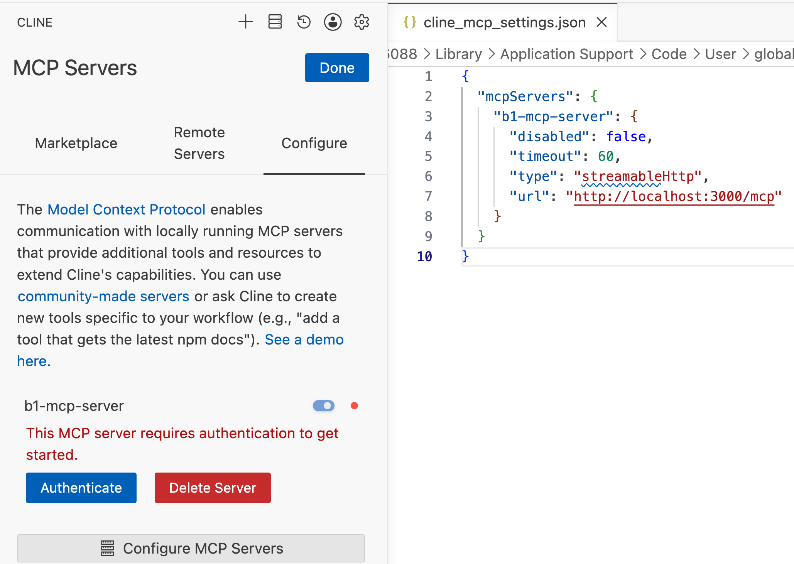
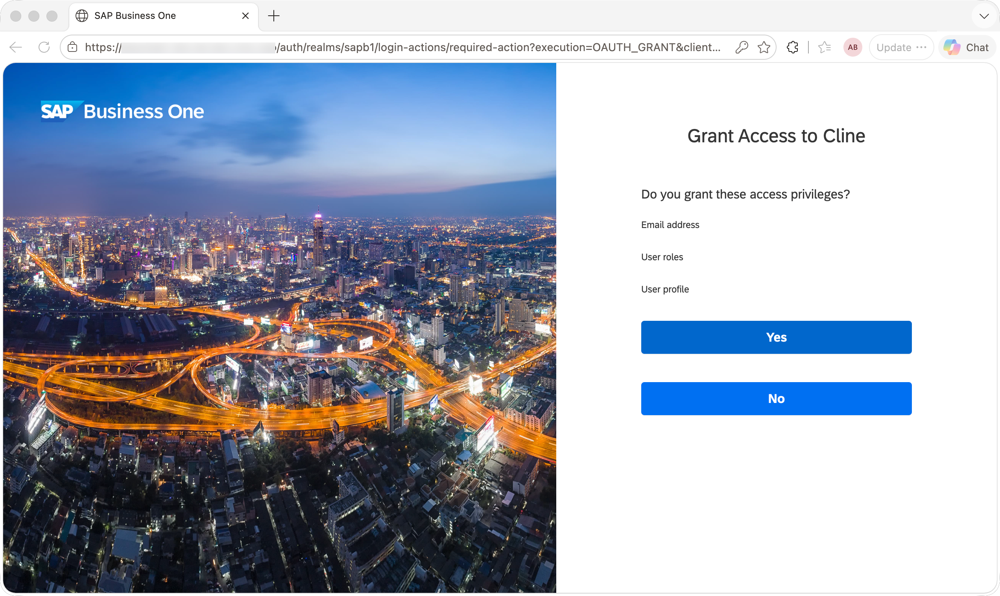
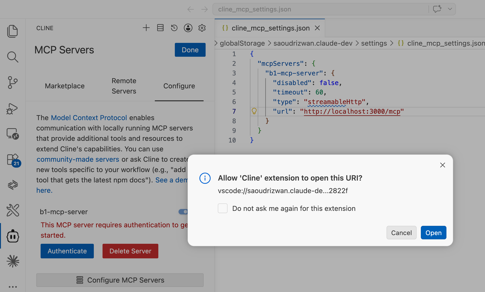
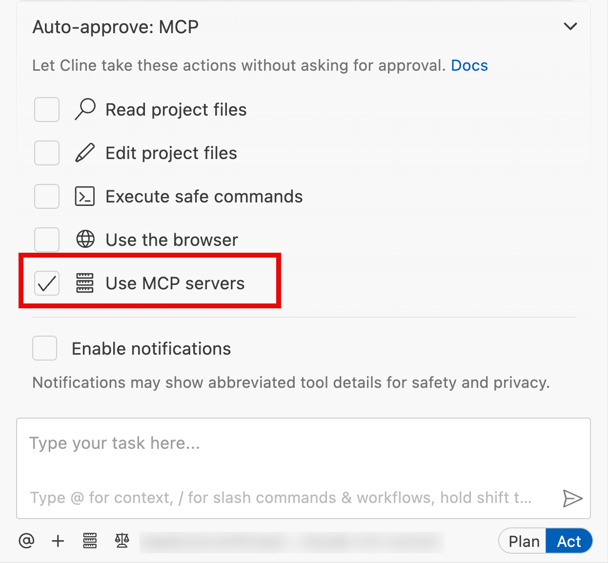

# Adding SAP B1 MCP Server to Cline

This guide provides step-by-step instructions for adding the SAP B1 MCP Server to Cline and testing it with Service Layer.

- [Adding SAP B1 MCP Server to Cline](#adding-sap-b1-mcp-server-to-cline)
  - [What is Cline?](#what-is-cline)
  - [Prerequisites](#prerequisites)
  - [Keycloak Setup for Cline (OAuth Mode)](#keycloak-setup-for-cline-oauth-mode)
  - [Add the MCP Server to Cline](#add-the-mcp-server-to-cline)
  - [Rule File (`.clinerules`)](#rule-file-clinerules)
  - [Test the MCP Server](#test-the-mcp-server)
    - [OAuth Company Selection Flow](#oauth-company-selection-flow)
    - [Example 1: List Available Entities](#example-1-list-available-entities)
    - [Example 2: Query Business Partners](#example-2-query-business-partners)
    - [Example 3: Get Order Details](#example-3-get-order-details)
    - [Example 4: Create Entity](#example-4-create-entity)
    - [Example 5: Update Entity](#example-5-update-entity)
    - [Example 6: Delete Entity](#example-6-delete-entity)
  - [Workflow Tools](#workflow-tools)
    - [Discovering Workflow Tools](#discovering-workflow-tools)
    - [Example: Copy a Document](#example-copy-a-document)
    - [Example: Create a Payment](#example-create-a-payment)


## What is Cline?

[Cline](https://github.com/cline/cline) is an open-source AI coding assistant for VS Code that can use MCP (Model Context Protocol) servers to interact with external systems. By connecting Cline to the B1 MCP Server, you can query and manage SAP Business One data directly from your editor using natural language.

> **Note:** As of **Cline v4.0.8**, [MCP Elicitation](https://modelcontextprotocol.io/docs/concepts/elicitation) is not yet supported in Cline. Features that rely on elicitation — such as human confirmation prompts for write operations (`MCP_HUMAN_CONFIRMATION_ENABLED=true`) — cannot be tested with Cline. To test elicitation, use **GitHub Copilot** instead.

## Prerequisites

- The MCP server is running and reachable at your MCP endpoint URL. For local development, this is typically http://localhost:3000/mcp.
- Service Layer is configured and accessible.
- Cline is installed on VSCode and properly configured.

## Keycloak Setup for Cline (OAuth Mode)

> This section applies **only if your MCP server runs in `AUTHENTICATION_MODE=oauth`**. If you are using `AUTHENTICATION_MODE=direct`, skip this section and proceed to [Add the MCP Server to Cline](#add-the-mcp-server-to-cline).

For the complete four-step Keycloak configuration (client registration, client scope, audience mapper, trusted hosts), see [KEYCLOAK_SETUP.md](./KEYCLOAK_SETUP.md).

## Add the MCP Server to Cline

**Step 1 — Add the MCP server**

1. Open Cline in VS Code and click **Manage MCP Servers** below the prompt box.

2. Click **Settings** → **Configure MCP Servers** to open `cline_mcp_settings.json`.

3. Add the server entry and save:

   ```json
       {
         "mcpServers": {
           "b1-mcp-server": {
             "disabled": false,
             "timeout": 60,
             "type": "streamableHttp",
             "url": "http://localhost:3000/mcp"
           }
         }
       }
   ```

   

4. On saving, Cline will automatically load the MCP server configuration and display a message for OAuth mode, indicating that this MCP server requires authentication to get started, like below:

   

5. Click **Authenticate** to start the login flow. This will open a browser window for Keycloak login and access grant.

   


6. Input credential and grant the access, the browser will redirect to VS Code Cline, asking you to allow Cline extension to open this URI. 

    


7. Open the URI to finish the authentication flow. Wait for a while, from the right bottom corner of VS Code, you will see a message to indicate that the MCP server is authenticated successfully and connected to Cline.


**Step 2 — Configure the LLM provider**

Cline requires an LLM API key to function. To configure the provider:

1. With Cline open, click **Select Model / API Providers** below the prompt box.
2. Choose your API provider (Claude, OpenAI, Azure OpenAI, etc.) and enter your API key.
3. Select your preferred model (e.g. `claude-sonnet-4-6`, `gpt-4o`).


**Step 3 — only use MCP Servers**

Click the **Auto-approve** arrow link above the Cline chat panel, unselect others and only select the **Use MCP servers**. This will avoid the potential impact of other built-in tools that might distract Cline from using the MCP server. 



**Step 4 — Verify**

Open the Cline chat panel, type a simple query such as `"List available B1 entities"`, and confirm that `b1_find_entities` is called and returns results.

## Rule File (`.clinerules`)

To guide Cline in using the MCP server correctly for your project, create a `.clinerules` file in your project root (or `AGENTS.md` for multi-agent environments). Cline reads this file automatically and follows the rules when composing requests.

Example:

```markdown
# SAP B1 MCP Server Integration Rules

- Always use the discovery approach: b1_find_entities → b1_get_entity_schema → b1_read/b1_write
- Use category filters in b1_find_entities to narrow entity searches (e.g., category: 'sales', 'purchase', 'finance')
- Check b1://constants resources for reference data before asking users
```

## Test the MCP Server

Once the server is added to Cline, you can test it using the following examples:

### OAuth Company Selection Flow

When the MCP server runs in `AUTHENTICATION_MODE=oauth`, authentication alone is not enough to start querying SAP Business One data. The user identity must first be bound to a specific company.

Use the tools in this order:

1. Call `b1_list_companies` after OAuth login completes.
2. Review the returned `CompanySchemaName` values.
3. Call `b1_select_company` with the selected `CompanySchemaName`.

Notes:

- `b1_list_companies` is primarily relevant in OAuth mode, where the available company list comes from SLD for the authenticated user.
- `b1_select_company` sets the active company context for subsequent requests.
- If no company is selected in OAuth mode, discovery and data-access tools may not return the expected SAP B1 results.

### Example 1: List Available Entities

Ask Cline:
```
Show me what entities are available in the SAP Business One Service Layer OData for Business Partner?
Show me 10 entities available in the SAP Business One Service Layer OData sales category?
Show me what entities are available for invoice in the SAP Business One Service Layer OData finance category?
```

This will use the `b1_find_entities` tool to retrieve a list of available entities.

### Example 2: Query Business Partners

Ask Cline:
```
Please show me the top 10 business partners order by balance
```

This will use the `b1_read` tool to perform a read operation on the BusinessPartners entity.

### Example 3: Get Order Details

Ask Cline:
```
Get details for order with DocEntry 12345
```

This will use the `b1_read` tool to retrieve a specific order by its key.

### Example 4: Create Entity

Ask Cline:
```
Create a new business partner with CardCode "C00001", CardName "ACME Inc", and CardType "cCustomer"
Create a new sales order for Customer C20000 with items A00001 (quantity 2) and A00002 (quantity 3)
```

This will use the `b1_write` tool to create a new business partner or create a new sales order.

### Example 5: Update Entity

Ask Cline:
```
Update business partner C00001 to set phone number to "+1 555-1234"
```

### Example 6: Delete Entity

Ask Cline:
```
Delete business partner with card code C00001
```

## Workflow Tools

In addition to the 3-step discovery tools, the server provides two workflow helpers for common Order-to-Cash operations:

| Tool                | Purpose                                                                                                                                           |
| ------------------- | ------------------------------------------------------------------------------------------------------------------------------------------------- |
| `b1_copy_document`  | Copies a source sales document (e.g. Order) into a downstream target (e.g. Delivery, Invoice) with automatic BaseType/BaseEntry/BaseLine handling |
| `b1_create_payment` | Validates and creates an incoming payment against one or more A/R invoices with auto or manual allocation                                         |

### Discovering Workflow Tools

Use `b1_find_entities` with `category='workflow'` to retrieve the workflow tool descriptors and their full parameter descriptions:

```
Show me what workflow tools are available in the B1 MCP server
```

The agent will call `b1_find_entities` with `category: 'workflow'` and receive the descriptions of `b1_copy_document` and `b1_create_payment`.

### Example: Copy a Document

```
Copy order with DocEntry 123 to a delivery note
```

### Example: Create a Payment

```
Create a payment of 5000 USD for customer C20000 against invoices 456 and 457
```