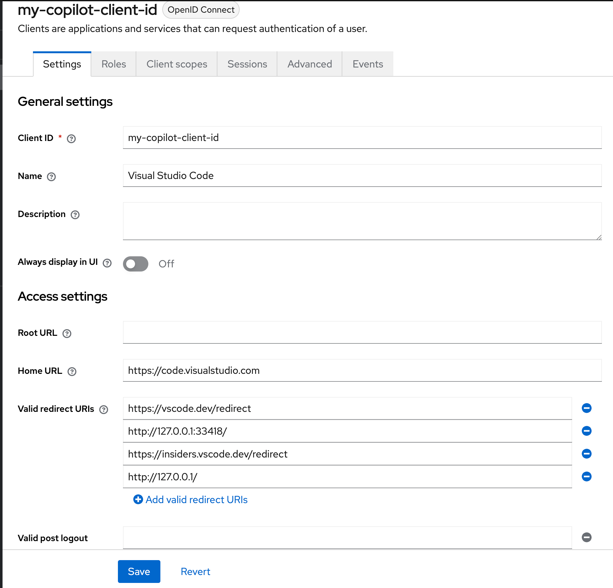
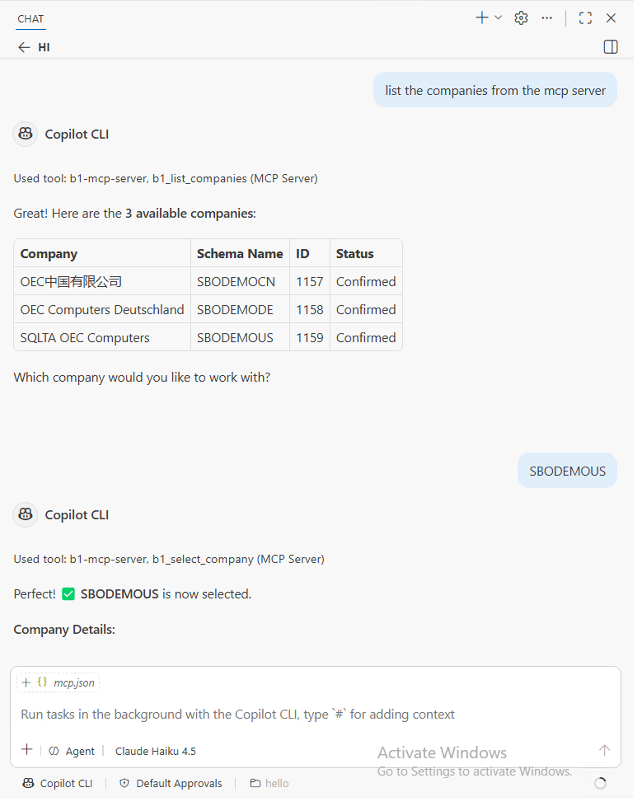

# Adding SAP B1 MCP Server to GitHub Copilot

This guide provides step-by-step instructions for connecting the SAP B1 MCP server to GitHub Copilot in VS Code and testing it with SAP Business One Service Layer.

## Prerequisites

- The MCP server is running and reachable at your MCP endpoint URL. For local development, this is typically `http://localhost:3000/mcp`
- SAP Business One Service Layer is configured and accessible
- GitHub Copilot is installed and signed in within VS Code
- Your VS Code version supports MCP server integration with GitHub Copilot

## Add the MCP Server to GitHub Copilot

GitHub Copilot supports the full OAuth PKCE flow and MCP Elicitation, making it the recommended client for testing OAuth mode and write confirmation prompts.

**Step 1 — Add the MCP server**

Create or update `.vscode/mcp.json` in your workspace root:

```json
{
  "servers": {
    "b1-mcp-server": {
      "type": "http",
      "url": "http://localhost:3000/mcp"
    }
  }
}
```

If your VS Code build expects a user-level MCP configuration instead of a workspace file, use the equivalent server definition there.

**Step 2 — Open Copilot Agent mode**

1. Open the GitHub Copilot Chat panel (`Ctrl+Alt+I` / `Cmd+Alt+I`).
2. Switch to **Agent** mode using the mode selector.
3. When Copilot calls a tool for the first time, VS Code will prompt you to allow the tool call — click **Allow**.
4. If tools do not appear, run **Developer: Reload Window** from the Command Palette.

**Step 3 — Optional: static OAuth client ID**

By default, GitHub Copilot registers a dynamic OAuth client with the MCP server. If you prefer a fixed client ID pre-registered in Keycloak (e.g. `my-copilot-client-id`), set it explicitly:

```json
{
  "servers": {
    "sap-b1-mcp-server": {
      "url": "http://localhost:3000/mcp",
      "type": "http",
      "oauth": {
        "clientId": "my-copilot-client-id"
      }
    }
  }
}
```

Write confirmation and sensitive-read elicitation prompts appear inline inside Copilot Chat and must be approved before the server proceeds.


## Keycloak Setup for GitHub Copilot (OAuth Mode — Testing Only)

> **Note:** The configuration below is only suitable for testing and experimentation. Do not use it in production.

If your MCP server is running in `AUTHENTICATION_MODE=oauth`, configure Keycloak as follows so GitHub Copilot can authenticate through VS Code:

**Step 1 — MCP Server client**

Register the MCP server as a confidential client in Keycloak in the following way:

1. In the Keycloak Admin Console, go to **Clients** → **Create client**.
2. Give it a unique **Client ID** such as `b1-mcp-server`, click **Next**, enable **Client authentication**, then click **Next**.
3. Set **Valid Redirect URIs** to your MCP server URL. For local development, for example, use `http://localhost:3000/*`, then save.
4. Open the **Credentials** tab, copy the **Client Secret**, and set it as `OAUTH_CLIENT_SECRET` in your `.env`.

**Step 2 — Client scope**

1. Go to **Client scopes** and create a new scope with exact name `b1_mcp:access`.
2. Set the scope type to `Default` and enable **Include in token scope**.
3. This scope grants access to the MCP tools and is required for token validation.

**Step 3 — Audience mapper**

1. Open the `b1_mcp:access` scope.
2. Go to **Mappers** → **Configure a new mapper** → **Audience**.
3. Set **Name** to `b1_mcp_audience_config` and **Included Client Audience** to your OAuth client ID such as `b1-mcp-server`.

**Step 4 — Trusted hosts**

1. Navigate to **Clients** → **Client registration** → **Trusted Hosts**.
2. Disable **Client URIs Must Match** and add the host IP addresses you are testing from.
3. GitHub Copilot in VS Code may use a local or bridged address during the flow. If needed, check Keycloak logs for entries such as `Failed to verify remote host : <IP>` to find the correct IP (e.g. 172.30.4.190).

With this configuration, the MCP server can receive a token that includes the `b1_mcp:access` scope and validate it against Keycloak. 

### Use Static Client ID

In the OAuth mode, a dynamic authentication flow will be triggered on the first tool call that requires authentication. Follow the prompts to authenticate and select a company before making further requests. In the process, a dynamic client id will be generated for the session and displayed in the logs. You can use this client id to monitor the session in Keycloak. 

If you prefer a fixed client id (e.g. `my-copilot-client-id`), you can configure it in the keycloak client settings with proper redirect URIs like below:

 

and set it in the `mcp.json` configuration as follows:

```json
{
  "servers": {
    "sap-b1-mcp-server": {
      "url": "http://localhost:3000/mcp",
      "type": "http",
      "oauth": {
        "clientId": "my-copilot-client-id"
      }
    }
  },
  "inputs": []
}

```

## Test the MCP Server with GitHub Copilot

### OAuth Company Selection Flow

When the MCP server runs in `AUTHENTICATION_MODE=oauth`, authentication alone is not enough to start querying SAP Business One data. The OAuth identity must first be bound to a specific company.

Use the tools in this order:

1. Call `b1_list_companies` after OAuth login completes.
2. Review the returned `CompanySchemaName` values.
3. Call `b1_select_company` with the selected `CompanySchemaName`.
4. After that, use tools such as `b1_find_entities`, `b1_get_entity_schema`, `b1_read`, and `b1_write`.

Example flow:

```text
1. b1_list_companies
2. b1_select_company { "companySchemaName": "SBODEMOUS" }
3. b1_find_entities { "query": "order" }
```



Ask GitHub Copilot:

```text
Show me what companies are available in SAP Business One?
select the SBODEMOUS company in SAP Business One for me.
```

Notes:

- `b1_list_companies` is primarily relevant in OAuth mode, where the available company list comes from SLD for the authenticated user.
- `b1_select_company` sets the active company context for subsequent requests.
- If no company is selected in OAuth mode, discovery and data-access tools may not return the expected SAP B1 results.

Once the server is connected, you can test it using the prompts in GitHub Copilot Chat.

### Example 1: List Available Entities

Ask GitHub Copilot:

```text
Show me what entities are available in the SAP Business One Service Layer OData for Business Partner?
Show me 10 entities available in the SAP Business One Service Layer OData sales category?
Show me what entities are available for invoice in the SAP Business One Service Layer OData finance category?
```
This will use the `b1_find_entities` tool to retrieve a list of available entities.

### Example 2: Reading Sensitive Fields (Elicitation)

GitHub Copilot supports MCP elicitation, which means the server can pause a tool call and ask you to confirm before returning sensitive data.

When your query selects fields that are classified as personal data (such as email addresses, phone numbers, or identity numbers), the server triggers an elicitation prompt inside Copilot Chat before proceeding.

Ask GitHub Copilot:

```text
Read the first 5 business partners and include their email address and phone number.
```

GitHub Copilot will display a confirmation prompt similar to:

```
CONFIRM SENSITIVE READ OPERATION | ENTITY: BusinessPartners | SELECTED_FIELDS: CardCode,CardName,EmailAddress,Phone1 | PERSONAL_FIELDS: CardName,EmailAddress,Phone1 | RISK: This query may expose sensitive data. | ACTION: Set confirmed=true only if you intend to continue.
```

You must approve the prompt before the server returns the results. If you decline, the request is cancelled and no data is returned.

### Example 3: Write Operations (Elicitation)

Write operations (create, update, delete) also trigger an elicitation confirmation before any data is modified in SAP Business One.

Ask GitHub Copilot:

```text
Update business partner C00001 to set the phone number to "+1 555-1234".
```

GitHub Copilot will display a confirmation prompt similar to:

```
CONFIRM WRITE OPERATION | OPERATION: update | ENTITY: BusinessPartners | TARGET: C00001 | FIELDS: Phone1=+1 555-1234 | RISK: This action will modify SAP Business One data. | ACTION: Set confirmed=true only if you intend to continue.
```

You must explicitly approve the prompt to allow the write to proceed. If you decline, no changes are made.

> **Note:** Elicitation support requires a VS Code build that supports MCP elicitation. If your version does not support it, the server will reject sensitive reads and write operations rather than proceeding without confirmation.