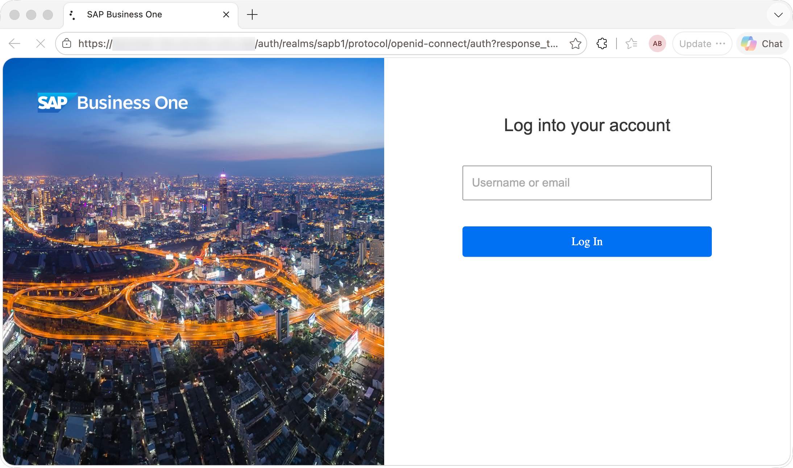
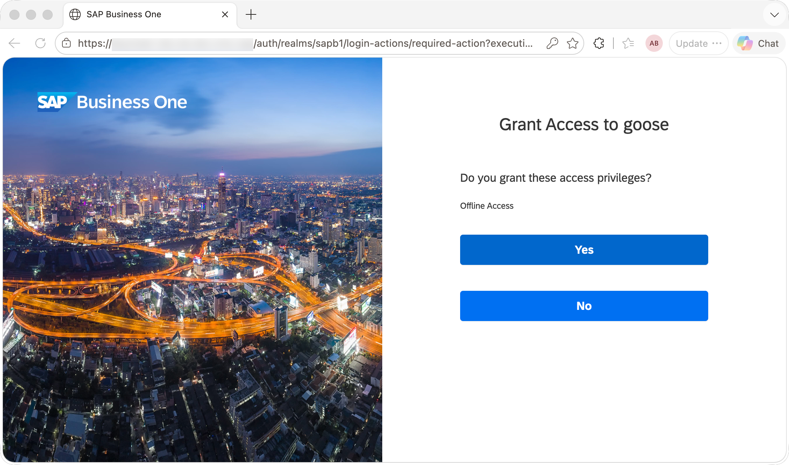
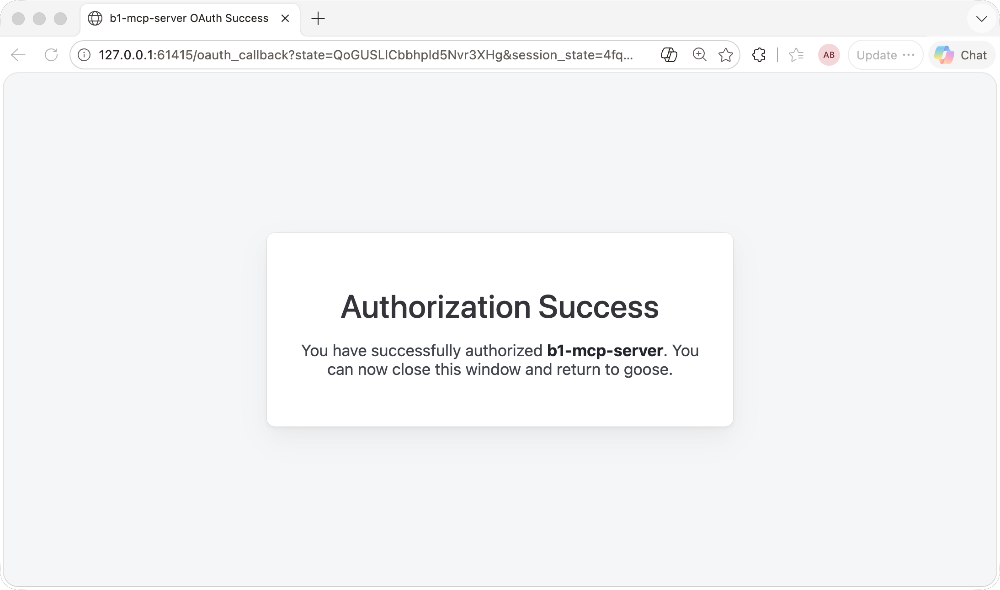
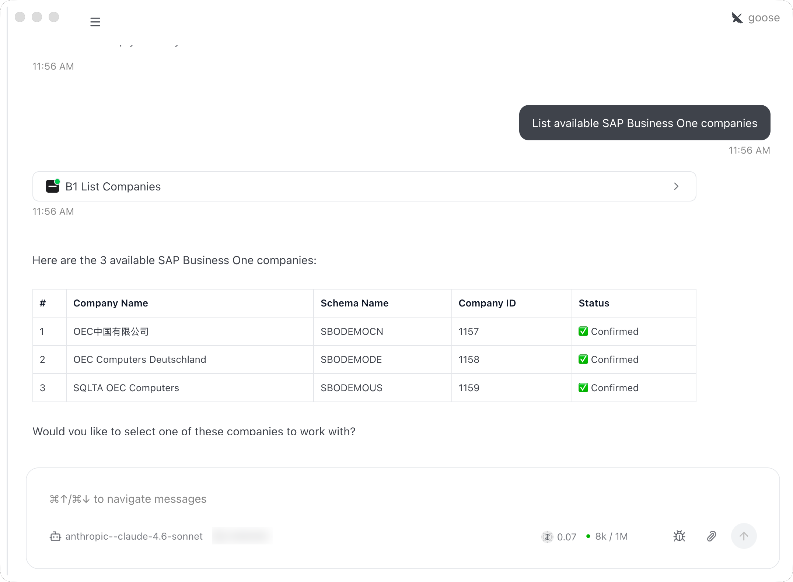
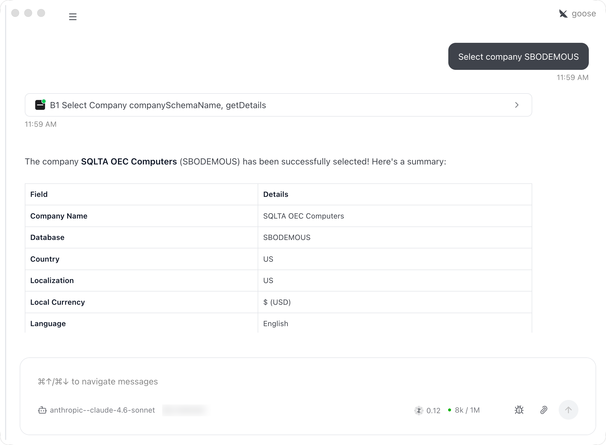
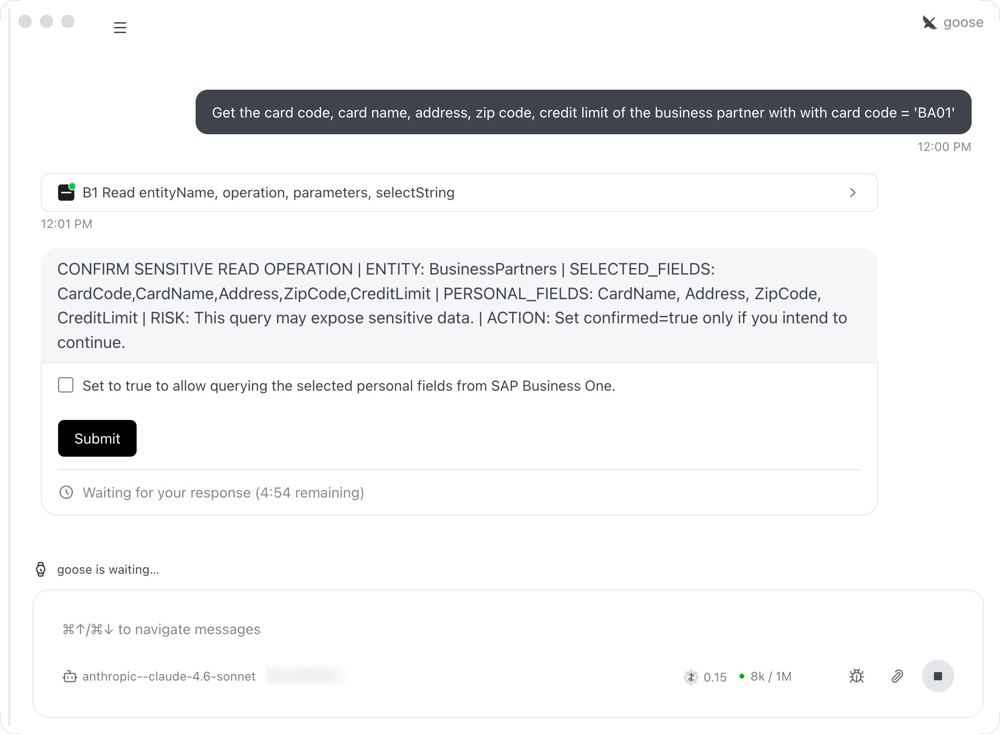
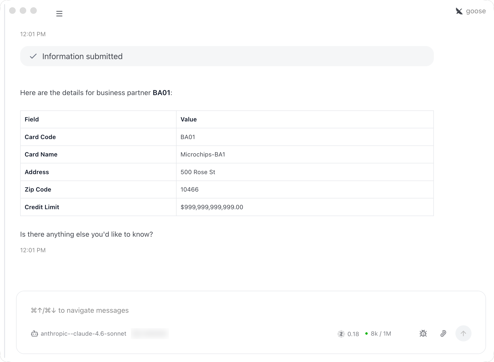

# Adding SAP Business One MCP Server to Goose

This guide provides step-by-step instructions for connecting the B1 MCP Server to Goose using OAuth 2.0 authentication and testing it with SAP Business One Service Layer.

- [Adding SAP Business One MCP Server to Goose](#adding-sap-business-one-mcp-server-to-goose)
  - [What is Goose?](#what-is-goose)
  - [Prerequisites](#prerequisites)
  - [Keycloak Setup for Goose](#keycloak-setup-for-goose)
  - [Add the MCP Server to Goose](#add-the-mcp-server-to-goose)
  - [Authenticate](#authenticate)
  - [Select a Company](#select-a-company)
  - [Examples](#examples)
    - [Read Sensitive Data](#read-sensitive-data)
  - [Troubleshooting](#troubleshooting)
    - [Authentication failures](#authentication-failures)
    - [Write operations blocked](#write-operations-blocked)

---

## What is Goose?

[Goose](https://goose-docs.ai/) is an extensible open-source AI agent that runs on your machine. Unlike IDE-embedded assistants, Goose works as a standalone agent — available as a desktop app, CLI, and API — and can handle code, research, writing, automation, data analysis, and more. It supports the Model Context Protocol (MCP), which means any MCP server can be added as an extension to expand what Goose can do.

---

## Prerequisites

- Goose >= 1.38.0 installed (desktop app). See [https://goose-docs.ai/docs/getting-started/installation](https://goose-docs.ai/docs/getting-started/installation) for installation instructions.
- The B1 MCP server is running in `AUTHENTICATION_MODE=oauth` and reachable (e.g. `https://localhost:3000/mcp`).
- SAP B1 Service Layer and SLD are configured and accessible.
- Keycloak realm configured with the `b1_mcp:access` scope — see [KEYCLOAK_SETUP.md](./KEYCLOAK_SETUP.md). Step 4 (trusted hosts for Dynamic Client Registration) is required for Goose.

---

## Keycloak Setup for Goose

Goose has a built-in OAuth 2.0 Authorization Code + PKCE flow. When it connects to an OAuth-protected MCP server, it automatically discovers the authorization endpoints from `/.well-known/oauth-protected-resource` and opens a browser window for login. Goose registers itself in Keycloak automatically at runtime using OAuth 2.0 Dynamic Client Registration (RFC 7591) — no manual client registration is required.

For the complete four-step Keycloak configuration (client scope, audience mapper, trusted hosts), see [KEYCLOAK_SETUP.md](./KEYCLOAK_SETUP.md).

---

## Add the MCP Server to Goose

1. Open the Goose desktop app.
2. Click **Extensions** in the sidebar.
3. Click **Add custom extension**.
4. Fill in the extension details:

   | Field | Value |
   |---|---|
   | **Name** | b1-mcp-server |
   | **Type** | `Streamable HTTP` |
   | **Description** | SAP Business One MCP Server |
   | **Endpoint** | `https://localhost:3000/mcp` |
   | **Timeout** | `10000` |

5. Click **Add Extension** and confirm the extension is enabled.

---

## Authenticate

When Goose first calls the MCP server, it detects the OAuth metadata and initiates the PKCE flow automatically:

1. Goose opens your browser to the Keycloak login page.

   

2. Log in with your SAP B1 credentials and grant access to Goose

   

3. Keycloak redirects back to Goose with an authorization code, which Goose exchanges for an access token automatically.

   

## Select a Company

Once authenticated, select a company before calling any entity tools:

1. Ask Goose: `List available SAP Business One companies`
   - Goose calls `b1_list_companies` and returns the companies your user is entitled to access.
   
   
   
2. Ask Goose: `Select company SBODEMOUS` (use the `CompanySchemaName` from the previous step)
   - Goose calls `b1_select_company` to bind the session to that company.
   
   

All subsequent entity tool calls will use the selected company context.

---

## Examples

Once connected and a company is selected, you can interact with SAP Business One data using natural language. Goose follows the 3-step discovery pattern automatically.

### Read Sensitive Data

1. Ask Goose: Get the card code, card name, address, zip code, credit limit of the business partner with card code = 'BA01'
   - Goose calls `b1_find_entities` to locate the `BusinessPartners` entity.
   - Goose calls `b1_get_entity_schema` to retrieve the schema and available properties for the `BusinessPartners` entity.
   - Goose calls `b1_read` to retrieve the requested properties for the specified business partner.
  
  

---

## Troubleshooting

### Authentication failures

- Confirm the server is running: `curl http://localhost:3000/health`
- Verify the endpoint URL in the extension config matches the running server address.
- Restart Goose after making configuration changes.
- Check Keycloak trusted hosts configuration if authentication fails with a host verification error — see [KEYCLOAK_SETUP.md](./KEYCLOAK_SETUP.md).
- If the OAuth flow still fails or token expires, try the following recovery steps in order:
  1. Clear your browser cache and cookies.
  2. Restart the MCP server.
  3. Remove and re-add the extension in Goose.
  4. Restart Goose.

### Write operations blocked

- If `MCP_HUMAN_CONFIRMATION_ENABLED=true`, Goose will display an elicitation confirmation prompt before write operations. Approve the prompt to proceed, or set `MCP_HUMAN_CONFIRMATION_ENABLED=false` in `.env` for automated pipelines.
