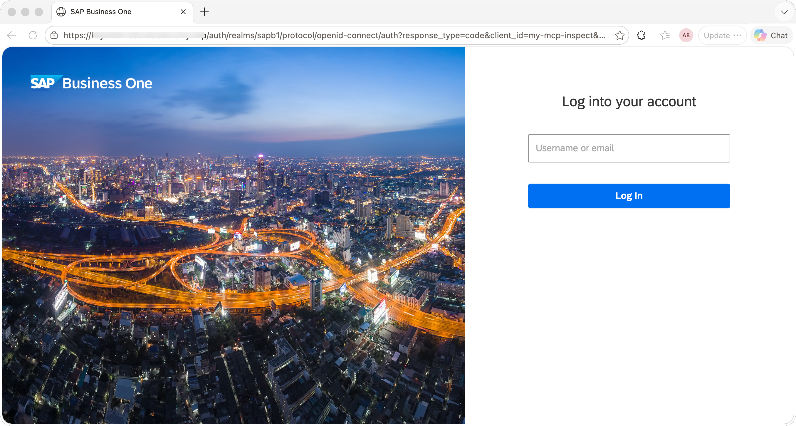
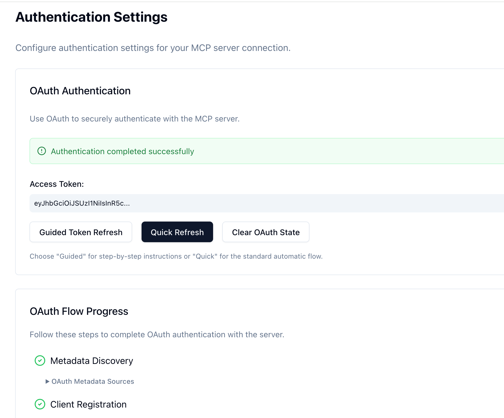
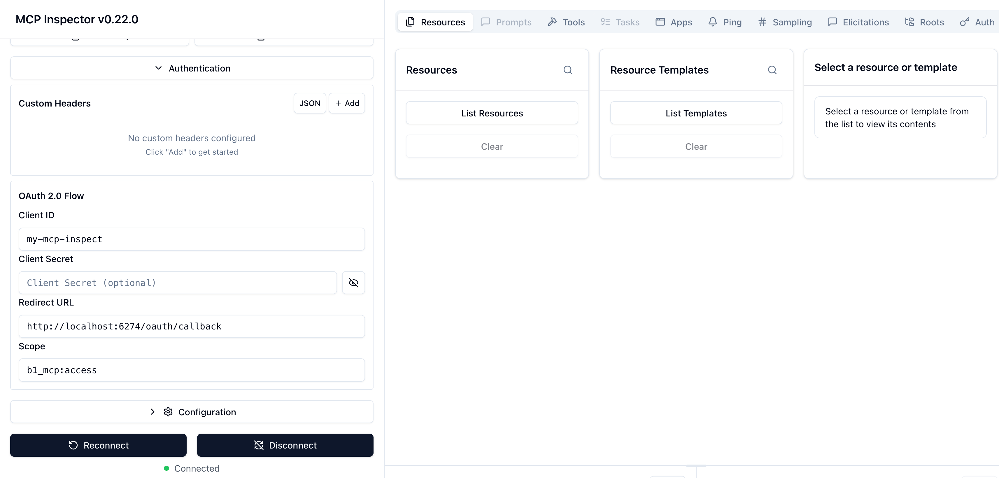
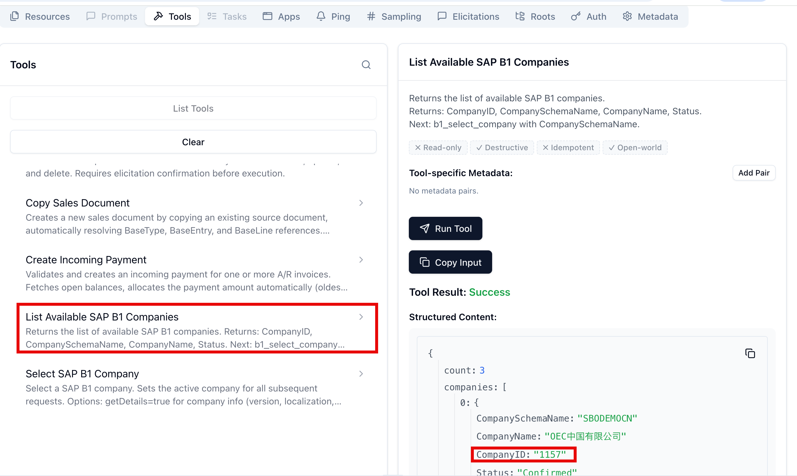
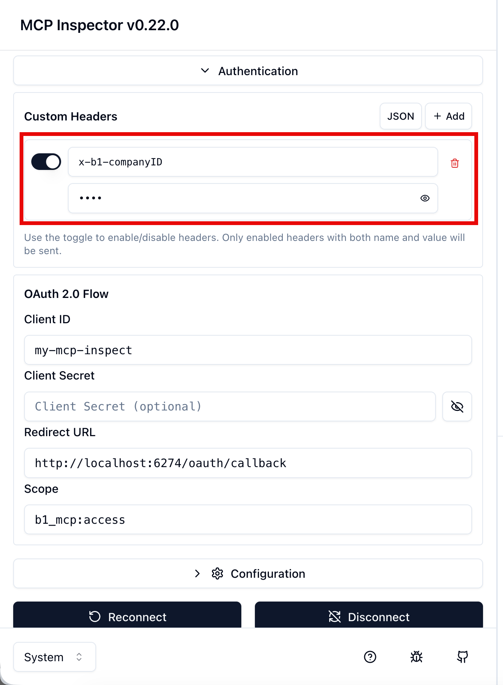
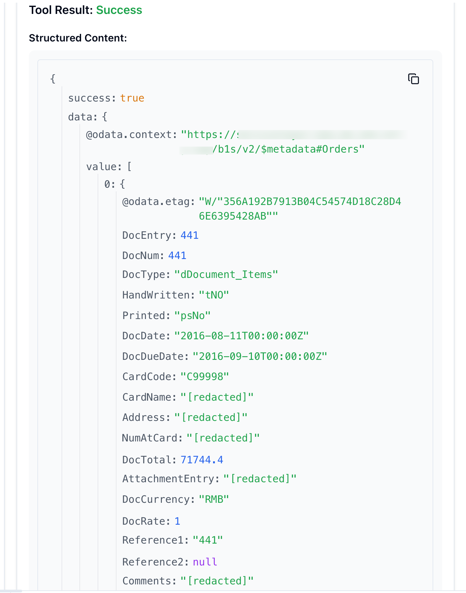

# MCP Inspector Usage Guide

The [MCP Inspector](https://github.com/modelcontextprotocol/inspector) is the primary tool for interactively exploring and debugging MCP servers. It opens a browser UI where you can browse available tools, call them manually, and inspect raw request/response messages — without needing a full AI agent.

- [MCP Inspector Usage Guide](#mcp-inspector-usage-guide)
  - [Prerequisites](#prerequisites)
  - [Direct Mode](#direct-mode)
  - [OAuth Mode](#oauth-mode)
    - [Step 1 — Configure the inspector as a public OAuth client](#step-1--configure-the-inspector-as-a-public-oauth-client)
    - [Step 2 — Launch the inspector to start authentication](#step-2--launch-the-inspector-to-start-authentication)
    - [Step 3 — Set the company context](#step-3--set-the-company-context)
  - [Browsing and Calling Tools](#browsing-and-calling-tools)
    - [Example: Discover entities](#example-discover-entities)
    - [Example: Get entity schema](#example-get-entity-schema)
    - [Example: Read data](#example-read-data)
  - [Token Expiry](#token-expiry)

---

## Prerequisites

- Node.js >= 22.22.3 and npm >= 10.9.8
- MCP Inspector >= 0.22.0
- The B1 MCP server is running (see [README.md](../README.md) for setup instructions)
- For OAuth mode: a Keycloak scope and MCP server configured as described in [KEYCLOAK_SETUP.md](./KEYCLOAK_SETUP.md)

---

## Direct Mode

In direct mode the server handles authentication internally. No token is required to launch the inspector.

```bash
npm run inspect
```

The inspector starts a local UI server on **port 6274** by default. Open `http://localhost:6274` in your browser to access it. 
1. In the **Transport Type** dropdown, select **Streamable HTTP**.
2. In the **URL**, set http://localhost:3000/mcp.
You can immediately browse the available tools under the **Tools** tab and call them.

---

## OAuth Mode

In OAuth mode the `/mcp` endpoint requires a valid bearer token. The steps below walk through registering the inspector as a public OAuth client, authenticating via the built-in PKCE flow, and setting the company context header required by SAP B1.

### Step 1 — Configure the inspector as a public OAuth client

The MCP Inspector has a built-in OAuth 2.0 Authorization Code + PKCE flow. When it connects to an OAuth-protected MCP server, it automatically discovers the authorization endpoints from the server's `/.well-known/oauth-protected-resource` metadata and opens a browser window for login. For this flow to work, the inspector must be registered in Keycloak as a **public client** (no client secret).

**In Keycloak Admin Console:**

1. Go to **Clients** → **Create client**.
2. Set **Client ID** (e.g. `my-mcp-inspect`) and choose **OpenID Connect** as the protocol. Click **Next**.
3. In **Capability config**:
   - Enable **Standard Flow** (Authorization Code).
   - Set **Client authentication** to **Off** (public client — no secret).
   - Enable **Require PKCE** (or set PKCE Code Challenge Method to `S256`).
   - Click **Next**.
4. In **Access settings**:
   - set **Valid Redirect URIs** to `http://localhost:6274/*`.
   - set **Web Origins** to `http://localhost:6274`.
   - click **Save**.

Alternatively, register the client through the **Extension SSO Manager** using the **Desktop App** client type, which applies the correct public-client settings automatically. See [SIMPLE_MCP_CLIENT.md](./SIMPLE_MCP_CLIENT.md) for reference.

### Step 2 — Launch the inspector to start authentication

```bash
npm run inspect
```

The inspector starts a local UI server on **port 6274**. Open `http://localhost:6274` in your browser if it does not open automatically.


**In the MCP Inspector UI:**

1. In the **Transport Type** dropdown, select **Streamable HTTP**.
2. In the **URL**, set http://localhost:3000/mcp.

3. When you connect to the MCP server, the inspector detects the OAuth metadata and shows an OAuth configuration panel. Fill in:

   | Field | Value |
   |---|---|
   | **Client ID** | The client ID registered above (e.g. `my-mcp-inspect`) |
   | **Redirect URL** | http://localhost:6274/oauth/callback |
   | **Scope** | `b1_mcp:access` |

4. Click **Open Auth Settings**, in the **Authentication Settings**, click **Quick OAuth Flow**, the inspector opens your browser to the Keycloak login page. 

   

5. After login, Keycloak redirects back to the inspector with an authorization code, which the inspector exchanges for an access token automatically.

   

6. Up to this point, the inspector is configured to use OAuth 2.0 Authorization Code + PKCE flow. You can now call MCP tools with the obtained access token.

   


### Step 3 — Set the company context

In OAuth mode, every MCP request must also carry the target company. Add the following request header:

| Name | Value |
|---|---|
| `x-b1-companyID` | SAP B1 company id (e.g. `1157`) |

To find the available company IDs, call the `b1_list_companies` tool first (see below) — no company header is required for that specific tool.



In the inspector browser UI, follow these steps to set the `x-b1-companyID` header:

1. Click **Custom Headers** in the connection panel.
2. Add a header:
   - **Name**: `x-b1-companyID`
   - **Value**: `your-company-id(e.g. 1157)` (copy the company id from `b1_list_companies`)
3. To ensure the `x-b1-companyID`  takes effect, refresh the page and reconnect.



---

## Browsing and Calling Tools

Once connected, the inspector shows the full list of available tools:

| Tab | Purpose |
|---|---|
| **Tools** | Browse all registered MCP tools, view their input schemas, and call them with custom arguments |
| **Resources** | Browse MCP resources (e.g. `b1://constants/objectTypes`) |
| **Elicitations** | When the server requests information from the user, requests will appear here for response. |

### Example: Discover entities

1. Open the **Tools** tab and select `b1_find_entities`.
2. Enter arguments:
   ```json
   { "query": "orders", "limit": 2 }
   ```
3. Click **Run Tool** and inspect the response.

### Example: Get entity schema

1. Select `b1_get_entity_schema`.
2. Enter arguments to get the top-level schema (Step 2.1):
   ```json
   { "entityName": "Orders" }
   ```
3. Click **Run Tool**. The response lists all scalar properties, key properties, and `structuralProperties[]`.
4. To drill into a structural type (Step 2.2), call again with the `complexTypeName` from a `structuralProperties` entry:
   ```json
   { "entityName": "Orders", "structuralTypeName": "DocumentLine" }
   ```

### Example: Read data

1. Select `b1_read`.
2. Enter arguments:
   ```json
   {
     "entityName": "Orders",
     "operation": "read",
     "topNumber": 2,
     "filterString": "DocumentStatus eq 'bost_Open'",
     "orderbyString": "DocEntry desc"
   }
   ```
3. Click **Run Tool**. A structured response is returned with the requested data. You can expand the JSON tree to inspect individual fields, including personal data fields that are redacted.



---

## Token Expiry

Access tokens are short-lived (typically 25–30 minutes). If the inspector returns `401 Unauthorized`, the token has expired. In the **Authentication Settings** panel, click **Quick OAuth Flow** again to re-authenticate and obtain a new token — no need to relaunch the inspector.
