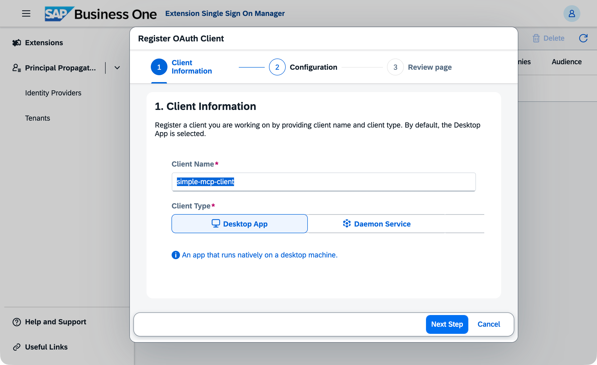
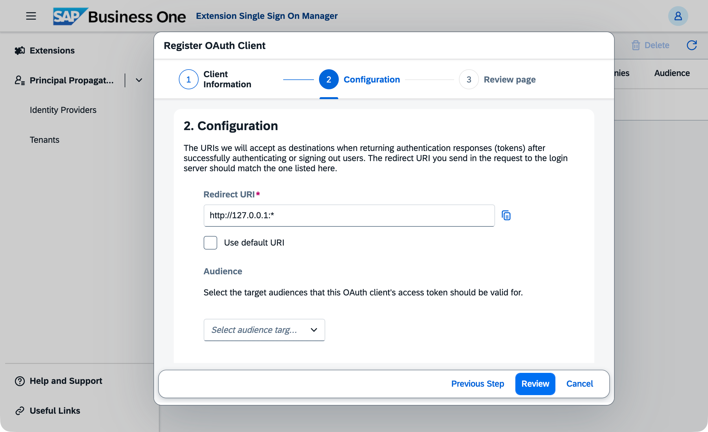
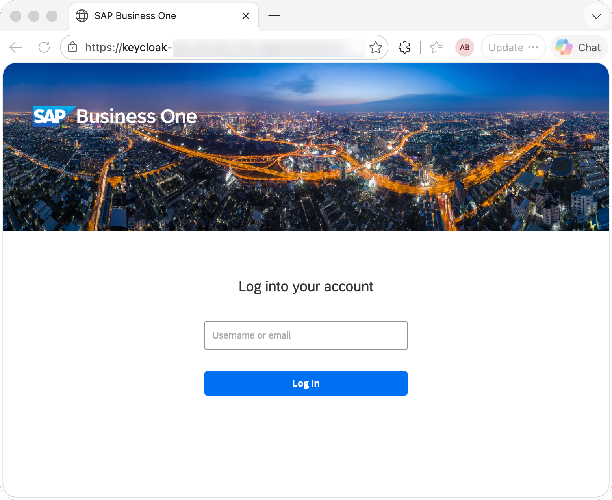
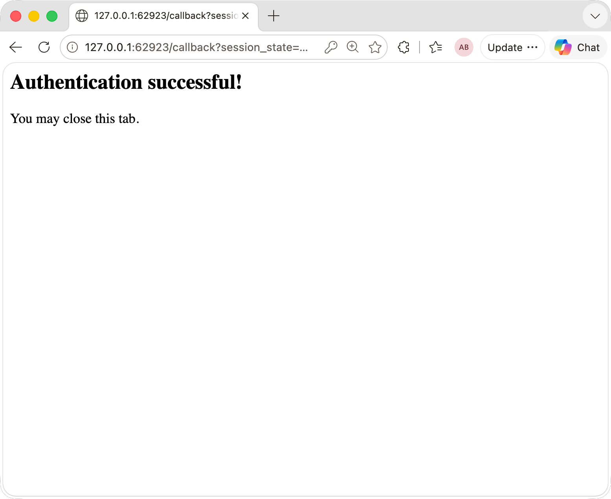

# Simple MCP Client Sample

- [Simple MCP Client Sample](#simple-mcp-client-sample)
  - [Prerequisites](#prerequisites)
  - [Extension SSO Manager Configuration](#extension-sso-manager-configuration)
    - [Keycloak Configuration](#keycloak-configuration)
  - [Environment Variables](#environment-variables)
  - [Running the Sample](#running-the-sample)
  - [What It Does](#what-it-does)
    - [Step 1 — Authenticate (OAuth 2.0 PKCE)](#step-1--authenticate-oauth-20-pkce)
    - [Step 2 — Fetch the Company List from SLD](#step-2--fetch-the-company-list-from-sld)
    - [Step 3 — Select a Company](#step-3--select-a-company)
    - [Step 4 — Discover Entity Types (`b1_find_entities`)](#step-4--discover-entity-types-b1_find_entities)
    - [Step 5 — Explore Entity Schema (`b1_get_entity_schema`)](#step-5--explore-entity-schema-b1_get_entity_schema)
    - [Step 6 — Read Entity Data (`b1_read`)](#step-6--read-entity-data-b1_read)
  - [Token Lifecycle](#token-lifecycle)
  - [Connecting to the MCP Server](#connecting-to-the-mcp-server)
  - [Expected Output](#expected-output)


A self-contained TypeScript example that shows B1 partners how to connect to the SAP Business One MCP server using OAuth 2.0, select a company, and call the available MCP tools.

**File:** [simple-mcp-client.ts](../src/sample/simple-mcp-client.ts)

---


## Prerequisites

| Requirement | Details |
|---|---|
| Node.js ≥ 22 | Required by this project |
| Running B1 MCP server | `http://localhost:3000` |
| `b1_mcp:access` client scope in Keycloak | The scope must exist in your Keycloak realm. Tokens without this scope are rejected by the MCP server. For setup instructions, see [KEYCLOAK_SETUP.md](./KEYCLOAK_SETUP.md). |
| Authentication server enabled in SLD Control Center | The SAP Business One Authentication Server (or another supported identity provider) must be registered and enabled in the SLD Control Center. |

---

## Extension SSO Manager Configuration

Login to the Extension SSO Manager and register a new OAuth client with the following settings:

- **Client Name**: `simple-mcp-client` (or any name you prefer)

- **Client Type**: `Desktop App`. This sample is a native console application that runs on the user's machine and opens a browser for authentication, the "**Desktop App**" client type is the most appropriate choice in the Extension SSO Manager. This client type is designed for applications that cannot securely store a client secret.

  

- **Redirect URIs**: `http://127.0.0.1:*`

  

Alternatively, you can register the client directly in your identity provider (e.g. Keycloak) if you prefer, just make sure to use the same redirect URI settings.

### Keycloak Configuration

Follow these steps to set up the required client configuration:
1. Log in to the Keycloak admin console and select your realm.
2. Go to "Clients" and click "Create" to add a new client.
3. Set the Client ID to `simple-mcp-client` (or any name you prefer) and choose "OpenID Connect" as the Client type. Click "Next";
4. In the Capability config settings, set "Require PKCE" to "On" and enable "Standard Flow". Click "Next".
5. In the Login settings, Set the "Valid Redirect URIs" to `http://127.0.0.1:*` and Save.

The sample starts a temporary local HTTP server on a random port to receive the OAuth callback. Register `http://127.0.0.1:*` (wildcard port) or a fixed port as an allowed redirect URI in Keycloak.


## Environment Variables

Create a `.env` file in the project root (or export these in your shell):

```env
# URL of the B1 MCP server (required)
MCP_SERVER_URL=https://your-mcp-server.example.com

# OAuth 2.0 client ID registered in your identity (required)
TEST_MCP_CLIENT_ID=simple-mcp-client

# Root URL of the SAP B1 System Landscape Directory (required)
SLD_ROOT_URL=https://sld.example.com

# OAuth scopes to request
TEST_OAUTH_SCOPES=email b1_mcp:access profile

# Set to 'true' only in development when the server uses a self-signed TLS certificate
AUTH_ALLOW_SELF_SIGNED=true
```

---


## Running the Sample

```bash
npm run simple-mcp-client
```

The sample is interactive — it opens a browser for SSO login and then prompts you to select a company from the terminal.

---

## What It Does

The sample walks through the full integration flow in six steps:

### Step 1 — Authenticate (OAuth 2.0 PKCE)

Discovers the OAuth endpoints automatically from the MCP server's
`/.well-known/oauth-protected-resource` metadata, then runs a browser-based
Authorization Code + PKCE flow:

1. A temporary local HTTP server starts to receive the callback
2. The browser opens the IDP login page
3. After login the IDP redirects back with an authorization code
4. The code is exchanged for an `access_token` and `refresh_token`
5. The browser tab closes automatically (if the browser permits it)





### Step 2 — Fetch the Company List from SLD

Calls the System Landscape Directory REST API with the access token to retrieve all SAP B1 company databases the authenticated user is entitled to access.

```
GET {SLD_ROOT_URL}/sld/sld0100.svc/CurrentUserInfo?IncludeB1UserBinding=true
Authorization: Bearer <access_token>
```

### Step 3 — Select a Company

Displays a numbered list of companies in the terminal and waits for the user to enter a choice. The selected company ID is then passed as the `x-b1-companyID` request header on every subsequent MCP call.

### Step 4 — Discover Entity Types (`b1_find_entities`)

Searches the B1 OData metadata for entity types matching a keyword. Use this to discover the correct entity name to pass to other tools.

```typescript
await client.callTool({
    name: 'b1_find_entities',
    arguments: { query: 'orders', limit: 5 },
});
```

### Step 5 — Explore Entity Schema (`b1_get_entity_schema`)

Returns the key properties, all scalar properties, and structural (complex) types of a given entity. Supports a two-step drill-down:

- **Step 5.1** — get the top-level schema (key fields, property list, structural types)
- **Step 5.2** — drill into a structural type such as `DocumentLine` to see its fields

```typescript
// Step 5.1 — top-level schema
await client.callTool({
    name: 'b1_get_entity_schema',
    arguments: { entityName: 'Orders' },
});

// Step 5.2 — drill into a structural type
await client.callTool({
    name: 'b1_get_entity_schema',
    arguments: { entityName: 'Orders', structuralTypeName: 'DocumentLine' },
});
```

### Step 6 — Read Entity Data (`b1_read`)

Queries B1 data through the Service Layer OData API.

| Operation | Description |
|---|---|
| `read` | List entities — supports `$top`, `$filter`, `$select`, `$orderby` |
| `read-single` | Fetch one entity by its key properties |

```typescript
await client.callTool({
    name: 'b1_read',
    arguments: {
        entityName: 'Orders',
        operation: 'read',
        topNumber: 3,
        selectString: 'DocEntry,DocNum,CardName,DocTotal,DocumentStatus',
        filterString: "DocumentStatus eq 'bost_Open'",
        orderByString: 'DocEntry desc',
    },
});
```
---


## Token Lifecycle

The sample handles token expiry automatically:

1. Before every operation, `getValidAccessToken()` checks whether the access token expires within the next 60 seconds
2. If it does, the `refresh_token` is used to silently obtain a new access token from the IDP — no browser interaction required
3. If the refresh token is unavailable or has itself expired, the browser PKCE flow is triggered again automatically

This logic is encapsulated in the `token()` closure inside `main()`. In your own integration, follow the same pattern: never hard-code the access token; always call a `getValidAccessToken`-style helper before connecting.

---

## Connecting to the MCP Server

The MCP client uses the `StreamableHTTPClientTransport` from `@modelcontextprotocol/sdk`. Two headers are required:

| Header | Value |
|---|---|
| `Authorization` | `Bearer <access_token>` |
| `x-b1-companyID` | SAP B1 company ID (e.g. `SBODEMOUS`) |

```typescript
const transport = new StreamableHTTPClientTransport(
    new URL(`${MCP_SERVER_URL}/mcp`),
    {
        requestInit: {
            headers: {
                Authorization: `Bearer ${accessToken}`,
                'x-b1-companyID': companyId,
            },
        },
    },
);
await client.connect(transport);
```

---

## Expected Output

When the sample runs successfully you will see output similar to the following. Actual values (company names, entity counts, order data) will vary by system.

```
[oauth] TLS certificate verification disabled (AUTH_ALLOW_SELF_SIGNED=true)
[Step 1] Discovering OAuth endpoints from: http://localhost:3000
(node:25910) Warning: Setting the NODE_TLS_REJECT_UNAUTHORIZED environment variable to '0' makes TLS connections and HTTPS requests insecure by disabling certificate verification.
(Use `node --trace-warnings ...` to show where the warning was created)
[Step 1] Opening browser for SSO login...
         (If the browser does not open, visit the URL below manually)
         https://<your idp server>/auth/realms/sapb1/protocol/openid-connect/auth?response_type=code&client_id=<your-mcp-client-id>&redirect_uri=http%3A%2F%2F127.0.0.1%3A54779%2Fcallback&code_challenge=YHQjMMliJgqWSREatJ9RUBM7fExKetaWmb1GnVfGNyU&code_challenge_method=S256&scope=email+b1_mcp%3Aaccess+profile
[Step 1] Authorization code received. Exchanging for access token...
[Step 1] Access token obtained successfully.

[Step 2] Fetching company list from SLD...
[Step 2] Found 3 company/ies.

[Step 3] Select a company:
         1. OEC中国有限公司 (1157)
         2. OEC Computers Deutschland (1158)
         3. SQLTA OEC Computers (1159)

         Enter number (1–3): 1

[Step 3] Connecting to: OEC中国有限公司 (1157)
[Step 4] Searching for entity types related to "orders"...
[Step 4] Found 5 matches:
         • Orders
         • IncomingPaymentOrders
         • OutgoingPaymentOrders
         • ProductionOrders
         • PurchaseOrders

[Step 5.1] Getting schema for the Orders entity...
[Step 5.1] Orders entity:
           Key properties : DocEntry
           Total properties: 290
           Structural types: Document_ApprovalRequests, DocumentLines, ElectronicProtocols, DocumentAdditionalExpenses, WithholdingTaxDataWTXCollection, WithholdingTaxDataCollection, DocumentSpecialLines, TaxExtension, AddressExtension, DocumentReferences, DocumentAdditionalIntrastatExpenses

[Step 5.2] Drilling into structural type: DocumentLine
[Step 5.2] DocumentLine has 233 properties.
           First 5: LineNum, ItemCode, ItemDescription, Quantity, ShipDate

[Step 6] Reading the 3 most recent open sales orders...
[Step 6] Retrieved 3 order(s):
         • DocNum 248 | 上海海龙信息技术有限公司 | Total: 6435
         • DocNum 291 | 深圳特达外贸公司 | Total: 11917.92
         • DocNum 339 | 广州运昌进出口贸易公司 | Total: 10568.61

Done. All steps completed successfully.
```
